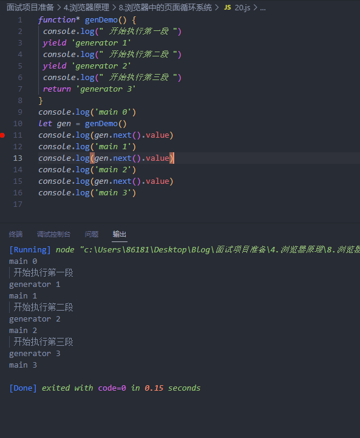
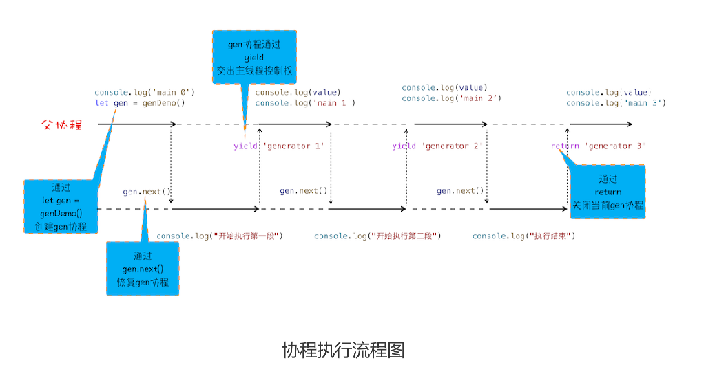
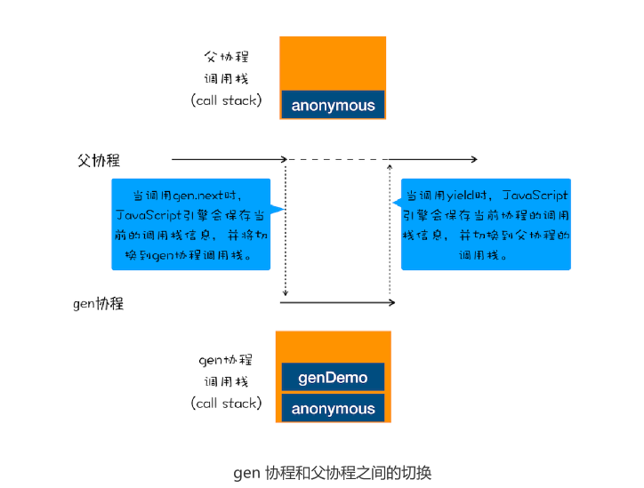
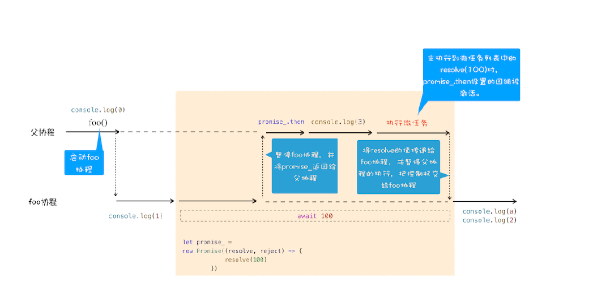

# 20|async/await：使用同步的方式去写异步代码

我们介绍了怎么使用 Promise 来实现回调操作，使用 Promise 能很好地解
决回调地狱的问题，但是这种方式充满了 Promise 的 then() 方法，如果处理流程比较复杂
的话，那么整段代码将充斥着 then，语义化不明显，代码不能很好地表示执行流程。


比如下面这样一个实际的使用场景：我先请求极客邦的内容，等返回信息之后，我再请求极
客邦的另外一个资源。下面代码展示的是使用 fetch 来实现这样的需求，fetch 被定义在
window 对象中，可以用它来发起对远程资源的请求，该方法返回的是一个 Promise 对
象，这和我们上篇文章中讲的 XFetch 很像，只不过 fetch 是浏览器原生支持的，并有没利
用 XMLHttpRequest 来封装。

```js
fetch('https://www.geekbang.org')
 .then((response) => {
 console.log(response)
 return fetch('https://www.geekbang.org/test')
 }).then((response) => {
 console.log(response)
 }).catch((error) => {
 console.log(error)
})
```

从这段 Promise 代码可以看出来，使用 promise.then 也是相当复杂，虽然整个请求流程
已经线性化了，但是代码里面包含了大量的 then 函数，使得代码依然不是太容易阅读


从这段Promise代码可以看出来，使用promise.then也相当复杂，虽然整个请求流程已经线性化，但是代码里面包含大量then，代码依然不太容易阅读，基于这个原因**基于这个原因，ES7 引入了 async/await，这是 JavaScript 异步编程的一个重大改进，提**
**供了在不阻塞主线程的情况下使用同步代码实现异步访问资源的能力，并且使得代码逻辑更加清晰**

```js
async function foo(){
    try{
        let response1=await fetch('https://www.geekbang.org')
         console.log(response1)
        let response2 = await fetch('https://www.geekbang.org/test')
        console.log('response2')
        console.log(response2)
    }catch(err){
         console.error(err)
    }
}
foo()
```

通过上面代码，你会发现整个异步处理的逻辑都是使用同步代码的方式来实现的，而且还支
持 try catch 来捕获异常，这就是完全在写同步代码，所以是非常符合人的线性思维的。但
是很多人都习惯了异步回调的编程思维，对于这种采用同步代码实现异步逻辑的方式，还需
要一个转换的过程，因为这中间隐藏了一些容易让人迷惑的细节。


那么本篇文章我们继续深入，看看 JavaScript 引擎是如何实现 async/await 的。如果上来
直接介绍 async/await 的使用方式的话，那么你可能会有点懵，所以我们就从其最底层的
技术点一步步往上讲解，从而带你彻底弄清楚 async 和 await 到底是怎么工作的。


本文我们首先介绍生成器（Generator）是如何工作的，接着讲解 Generator 的底层实现
机制——协程（Coroutine）；又因为 async/await 使用了 Generator 和 Promise 两种
技术，所以紧接着我们就通过 Generator 和 Promise 来分析 async/await 到底是如何以
同步的方式来编写异步代码的。


## 生成器VS协程

我们先来看看什么是生成函数

**生成函数是一个带星号函数，而且1可以暂停执行和恢复执行的**


```js
//执行上面这段代码，观察输出

function* genDemo() {
 console.log(" 开始执行第一段 ")
 yield 'generator 1'
 console.log(" 开始执行第二段 ")
 yield 'generator 2'
 console.log(" 开始执行第三段 ")
 return 'generator 3'
}
console.log('main 0')
let gen = genDemo()
console.log(gen.next().value)//
console.log('main 1')
console.log(gen.next().value)
console.log('main 2')
console.log(gen.next().value)
console.log('main 3')

```

生成器函数的具体使用方法:
1. 在生成器函数内部执行一段代码，如果遇到yield关键字，那么JavaScript引擎返回关键字后面的内容给外部，并暂停该函数的执行
2. 外部函数可以通过next方法恢复函数的执行
   

   关于函数的暂停和恢复，相信你一定很好奇这其中的原理，那么接下来我们就来简单介绍下
JavaScript 引擎 V8 是如何实现一个函数的暂停和恢复的，这也会有助于你理解后面要介绍
的 async/await。


要搞懂函数为何能暂停和恢复，那你首先了解协程的概念，**协程是一种比线程更加轻量级的存咋**，
你可以把协程看成跑在线程上的任务，一个线程可以存在多个协程，但是在线程同时只能执行一个协程，比如
当前执行的是A协程，要启动B协程，那么A协程就需要将主线程的控制权交给B协程，这就体现A协程暂停执行，B协程恢复执行；同样，也可以从B协程中启动A协程，通常，**如果从A协程启动B协程，我们就把A协程称为B协程的父协程**

正如一个进程可以拥有多个线程，一个线程也可以拥有多个协程。最重要的是，协程不是被操作系统内核所管理，而是完全由程序所控制（也就是在用户态执行）。这样带来的好处就是性能得到很大的提升，不像线程切换那样消耗资源。


next是交给下个协程，yield是回到父协程



太离奇了，断点调试发现一直在执行给gen函数，

yield就是返回到调用外（父协程）了，next就回到这个函数yield之后的步骤开始执行

gen函数是子协程


从图中可以看出来四点规则：

1. 通过调用生成函数genDemo来创建一个协程gen，创建之后，gen协程并没有立即执行
2. 要让gen协程执行，需要通过调用gen.next
3. 当协程正在执行的时候，可以通过yield关键字来暂停gen协程的执行，并返回主要信息给父协程。
4. 如果协程在执行期间，遇到return关键字，那么JavaScript引擎会结束当前协程，并将return 后面的内容返回给父协程

父协程有自己的调用栈，gen协程也有自己的调用栈，当gen协程通过yield把控制权交给父协程时，V8是如何切换到父协程的调用栈，，V8 是如何切换到父协程
的调用栈？当父协程通过 gen.next 恢复 gen 协程时，又是如何切换 gen 协程的调用栈？


要搞清楚两点：

1.   gen协程和父协程是在主线程上交互执行的，并不是并发执行的，它们之间的切换是通过yield和next来配合的
2.   当gen协程中调用yield方法时，JavaScript引擎会保存gen协程当前的调用栈信息，并恢复协程的调用栈信息。同样，当在父协程中执行 gen.next 时，
JavaScript 引擎会保存父协程的调用栈信息，并恢复 gen 协程的调用栈信息



到这里相信你已经弄清楚了协程是怎么工作的，其实在 JavaScript 中，生成器就是协程的
一种实现方式，这样相信你也就理解什么是生成器了。那么接下来，我们使用生成器和Promise 来改造开头的那段 Promise 代码。改造后的代码如下所示：


```js

//foo 函数
function* foo() {
 let response1 = yield fetch('https://www.geekbang.org')
 console.log('response1')
 console.log(response1)
 let response2 = yield fetch('https://www.geekbang.org/test')
 console.log('response2')
 console.log(response2)
}
// 执行 foo 函数的代码
let gen = foo()
function getGenPromise(gen) {
 return gen.next().value
}
getGenPromise(gen).then((response) => {
 console.log('response1')
 console.log(response)
 return getGenPromise(gen)
}).then((response) => {
 console.log('response2')
 console.log(response)
})
```

从图中可以看到，foo 函数是一个生成器函数，在 foo 函数里面实现了用同步代码形式来
实现异步操作；但是在 foo 函数外部，我们还需要写一段执行 foo 函数的代码，如上述代
码的后半部分所示，那下面我们就来分析下这段代码是如何工作的。


首先执行的是let gen = foo()，创建了 gen 协程。

然后在父协程中通过执行 gen.next 把主线程的控制权交给 gen 协程。

gen 协程获取到主线程的控制权后，就调用 fetch 函数创建了一个 Promise 对象
response1，然后通过 yield 暂停 gen 协程的执行，并将 response1 返回给父协程。

父协程恢复执行后，调用 response1.then 方法等待请求结果。

等通过 fetch 发起的请求完成之后，会调用 then 中的回调函数，then 中的回调函数拿

到结果之后，通过调用 gen.next 放弃主线程的控制权，将控制权交 gen 协程继续执行
下个请求。


## async/await

ES7 中引入了 async/await，这种方式能够彻底告别执行器和生成器，实现更加直观简洁的
代码。其实 async/await 技术背后的秘密就是 Promise 和生成器应用，往低层说就是微任
务和协程应用。要搞清楚 async 和 await 的工作原理，我们就得对 async 和 await 分开分
析。


### 1.async


根据MDN定义：async是一个通过**异步执行并隐式返回Promise**作为结果的函数。

```js
async function foo() {
 return 2
}
console.log(foo()) // Promise {<resolved>: 2}
```


执行这段代码，我们可以看到调用 async 声明的 foo 函数返回了一个 Promise 对象，状态
是 resolved，返回结果如下所示：


```js
Promise{<resolved>:2}
```


### 2.await

我们已经知道async函数返回一个Promise对象，那下面结合文中这段代码看看await到底是什么

```js

async function foo() {
    console.log(1)
    let a = await 100
    console.log(a);
    console.log(2)
}

console.log(0)
foo()
console.log(3)
```

```js
0
1
3
100
2
```



我们一起来分析async/await 的执行流程

首先，执行console.log(0)这个语句，打印出来0.

接着就是执行foo函数，由于foo函数是被async标记过，所以当进入该函数的时候，JavaScript引擎会保存当前的调用栈等信息，然后执行foo函数中的console.log(1)语句，并打印出1.


接下来就执行到foo函数的await 100语句，这里是我们分析的重点，因为在执行await 100语句时，JavaScript引擎在背后为我们默默做了很多事情，那么下面就把语句拆开，来看看JavaScript到底做了哪些事情


当执行到await 100，就默认创建一个Promise对象，代码如下

```js

let promise_=new Promise((resolve,reject){
    resolve(100)
})
```

在这个promise_对象创建过程中，我们可以看到executor函数调用resolve函数，JavaScript引擎会将该任务提交给微任务

然后JavaScript引擎会暂停当前协程的执行，将主线程的控制权转交给父协程执行，同时将promise_对象返回给父协程

主线程的控制器已经交给父协程，这时候父协程要做的一件事调用promise._then来监控promise状态的改变

接下来继续执行父协程的流程，这里我们执行console.log(3)，并打印出来 3。随后父
协程将执行结束，在结束之前，会进入微任务的检查点，然后执行微任务队列，微任务队列
中有resolve(100)的任务等待执行，执行到这里的时候，会触发 promise_.then 中的回
调函数，如下所示：


```js
promise_.then((value)=>{
 // 回调函数被激活后
 // 将主线程控制权交给 foo 协程，并将 vaule 值传给协程
})

```

该回调函数被激活以后，会将主线程的控制权交给 foo 函数的协程，并同时将 value 值传
给该协程。


foo 协程激活之后，会把刚才的 value 值赋给了变量 a，然后 foo 协程继续执行后续语
句，执行完成之后，将控制权归还给父协程。


## 总结
Promise 的编程模型依然充斥着大量的 then 方法，虽然解决了回调地狱的问题，但是在语
义方面依然存在缺陷，代码中充斥着大量的 then 函数，这就是 async/await 出现的原因。

使用 async/await 可以实现用同步代码的风格来编写异步代码，这是因为 async/await 的
基础技术使用了生成器和 Promise，生成器是协程的实现，利用生成器能实现生成器函数
的暂停和恢复。


另外，V8 引擎还为 async/await 做了大量的语法层面包装，所以了解隐藏在背后的代码有
助于加深你对 async/await 的理解。


async/await 无疑是异步编程领域非常大的一个革新，也是未来的一个主流的编程风格。其
实，除了 JavaScript，Python、Dart、C# 等语言也都引入了 async/await，使用它不仅
能让代码更加整洁美观，而且还能确保该函数始终都能返回 Promise。


## 思考


awiat 当前不会堵塞，后面的才会堵塞
每个宏任务对应一个微任务队列，当前执行微任务遇到新的微任务，添加到微任务队列中等待执行

```js
async function foo() {
 console.log('foo')
}
async function bar() {
 console.log('bar start')
 await foo()
 console.log('bar end')
}
console.log('script start')
setTimeout(function () {
 console.log('setTimeout')
}, 0)
bar();
new Promise(function (resolve) {
 console.log('promise executor')
 resolve();
}).then(function () {
 console.log('promise then')
})
console.log('script end')


script start
bar start
foo
promise executor
script end
bar end
promise then
setTimeout
```


