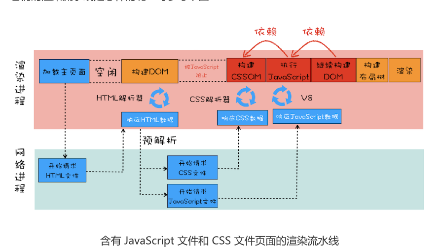
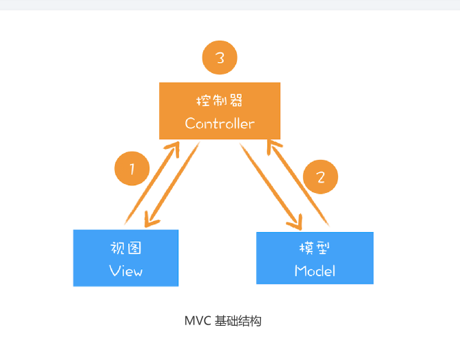

# 26 | 虚拟DOM：虚拟DOM和实际的DOM有何不同？

虚拟 DOM 是最近非常火的技术，两大著名前端框架 React 和 Vue 都使用了虚拟 DOM，
所以我觉得非常有必要结合浏览器的工作机制对虚拟 DOM 进行一次分析。当然了，React
和 Vue 框架本身所蕴含的知识点非常多，而且也不是我们专栏的重点，所以在这里我们还
是把重心聚焦在虚拟 DOM 上。

## DOM的缺陷

通过前面一系列文章的学习，你对 DOM 的生成过程应该已经有了比较深刻的理解，并且
也知道了通过 JavaScript 操纵 DOM 是会影响到整个渲染流水线的。另外，DOM 还提供
了一组 JavaScript 接口用来遍历或者修改节点，这套接口包含了 getElementById、
removeChild、appendChild 等方法。

比如，我们可以调用document.body.appendChild(node)往 body 节点上添加一个元
素，调用该 API 之后会引发一系列的连锁反应。首先渲染引擎会将 node 节点添加到 body
节点之上，然后触发样式计算、布局、绘制、栅格化、合成等任务，我们把这一过程称为重
排。除了**重排**之外，还有可能引起重绘或者合成操作，形象地理解就是“牵一发而动全身”。另外，对于 DOM 的不当操作还有可能引发强制**同步布局**和**布局抖动**的问题，这些
操作都会大大降低渲染效率。因此，对于 DOM 的操作我们时刻都需要非常小心谨慎。

## 什么是虚拟DOM
在谈论什么是虚拟DOM之前，我们先看虚拟DOM到达解决哪些事情

1. 将页面改变的内容应用到虚拟DOM上，而不是直接应用到DOM上‘
2. 变化被应用到虚拟DOM上时，虚拟DOM并不着急去渲染页面，而是仅仅调整虚拟DOM的内部状态，这样操作虚拟DOM的代价就变得非常轻。
3. 在虚拟DOM收集到足够的改变时，再把这些变化一次性应用到真实的DOM上。

基于以上三点，我们再来看看什么是虚拟 DOM。为了直观理解，你可以参考下图：

该图是我结合 React 流程画的一张虚拟 DOM 执行流程图，下面我们就结合这张图来分析
下虚拟 DOM 到底怎么运行的。

**创建阶段**。首先依据 JSX 和基础数据创建出来虚拟 DOM，它反映了真实的 DOM 树的
结构。然后由虚拟 DOM 树创建出真实 DOM 树，真实的 DOM 树生成完后，再触发渲
染流水线往屏幕输出页面。

**更新数据**。如果数据发生了改变，那么就需要根据新的数据创建一个新的虚拟DOM树；然后React比较两个数，找出变化的地方，并把变化的地方一次更新到真实的DOM树上;最后渲染引擎更新流水线，生成新的页面。

既然聊到虚拟DOM的更新，那么就不得不聊最新**react fiber**更新机制。

从单纯的技术视角来分析虚拟 DOM 的，那接下来我们再从双缓存和 MVC 模型这两个视
角来聊聊虚拟 DOM。

### 1.双缓存

在开发游戏或者处理其他图像的过程中，屏幕从前缓冲区读取数据然后显示。但是很多图形
操作都很复杂且需要大量的运算，比如一幅完整的画面，可能需要计算多次才能完成，如果
每次计算完一部分图像，就将其写入缓冲区，那么就会造成一个后果，那就是在显示一个稍
微复杂点的图像的过程中，你看到的页面效果可能是一部分一部分地显示出来，因此在刷新
页面的过程中，会让用户感受到界面的闪烁。

而使用双缓存，可以让你先将计算的中间结果存放在另一个缓冲区中，等全部的计算结束，
该缓冲区已经存储了完整的图形之后，再将该缓冲区的图形数据一次性复制到显示缓冲区，
这样就使得整个图像的输出非常稳定。

在这里，你可以把虚拟 DOM 看成是 DOM 的一个 buffer，和图形显示一样，它会在完成
一次完整的操作之后，再把结果应用到 DOM 上，这样就能减少一些不必要的更新，同时
还能保证 DOM 的稳定输出。

### 2.MVC模式

通过上图你可以发现，MVC 的整体结构比较简单，由模型、视图和控制器组成，其核心思
想就是**将数据和视图分离**，也就是说视图和模型之间是不允许直接通信的，它们之间的通信
都是通过控制器来完成的。通常情况下的通信路径是视图发生了改变，然后通知控制器，控
制器再根据情况判断是否需要更新模型数据。当然还可以根据不同的通信路径和控制器不同
的实现方式，基于 MVC 又能衍生出很多其他的模式，如 MVP、MVVM 等，不过万变不
离其宗，它们的基础骨架都是基于 MVC 而来。

