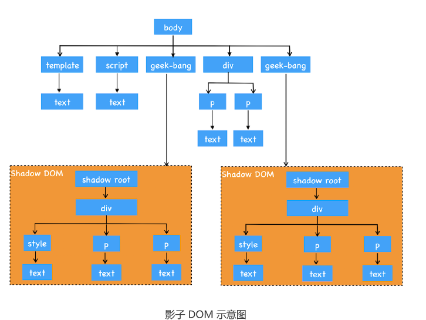

## WebComponet 组件化开发

现在我们了解了**CSS** 和 **DOM** 是阻碍组件化的两个因素，那要怎么解决呢？

WebComponent 给出了解决思路，它提供了对局部视图封装能力，可以让 DOM、
CSSOM 和 JavaScript 运行在局部环境中，这样就使得局部的 CSS 和 DOM 不会影响到全
局。


前面我们说了，WebComponent 是一套技术的组合，具体涉及到了Custom
elements（自定义元素）、Shadow DOM（影子 DOM）和HTML templates（HTML
模板）
```js
<!DOCTYPE html>
<html>
<body>
 <!--
一：定义模板
二：定义内部 CSS 样式
三：定义 JavaScript 行为
 -->
 <template id="geekbang-t">
 <style>
 p {
 background-color: brown;
 color: cornsilk
 }
 div {
 width: 200px;
 background-color: bisque;
 border: 3px solid chocolate;
 border-radius: 10px;
 }
 </style>
 <div>
 <p>time.geekbang.org</p>
 <p>time1.geekbang.org</p>
 </div>
 <script>
 function foo() {
 console.log('inner log')
 }
 </script>
 </template>
 <script>
 class GeekBang extends HTMLElement {
 constructor() {
 super()
 // 获取组件模板
 const content = document.querySelector('#geekbang-t').content
 // 创建影子 DOM 节点
 const shadowDOM = this.attachShadow({ mode: 'open' })
 // 将模板添加到影子 DOM 上
 shadowDOM.appendChild(content.cloneNode(true))
 }
 }
 customElements.define('geek-bang', GeekBang)
 </script>
 <geek-bang></geek-bang>
 <div>
 <p>time.geekbang.org</p>
 <p>time1.geekbang.org</p>
 </div>
 <geek-bang></geek-bang>
</body>
</html>
```
详细观察上面这段代码，我们可以得出：要使用 WebComponent，通常要实现下面三个
步骤。

**首先，使用template属性来创建模板**利用 DOM 可以查找到模板的内容，但是模板元
素是不会被渲染到页面上的，也就是说 DOM 树中的 template 节点不会出现在布局树
中，所以我们可以使用 template 来自定义一些基础的元素结构，这些基础的元素结构是可
以被重复使用的。一般模板定义好之后，我们还需要在模板的内部定义样式信息。


**其次，我们需要创建一个GeekBang的类**。在该类的构造函数要完成三件事

1. 查找模板内容
2. 创建影子DOM
3. 再将模板添加到影子DOM上


上面最难理解的是影子 DOM，其实影子 DOM 的作用是将模板中的内容与全局 DOM 和
CSS 进行隔离，这样我们就可以实现元素和样式的私有化了。你可以把影子 DOM 看成是
一个作用域，其内部的样式和元素是不会影响到全局的样式和元素的，而在全局环境下，要
访问影子 DOM 内部的样式或者元素也是需要通过约定好的接口的。


总之，通过影子 DOM，我们就实现了 CSS 和元素的封装，在创建好封装影子 DOM 的类
之后，我们就可以**使用 customElements.define 来自定义元素**了（可参考上述代码定义
元素的方式）。


最后，就很简单了，可以像**正常使用 HTML 元素一样使用该元素**，如上述代码中的<geek
-bang></geek-bang>。


影子 DOM 内部的样式是不会影响到全局 CSSOM 的。另外，使用
DOM 接口也是无法直接查询到影子 DOM 内部元素的，比如你可以使用document.getE
lementsByTagName('div')来查找所有 div 元素，这时候你会发现影子 DOM 内部的元
素都是无法查找的，因为要想查找影子 DOM 内部的元素需要专门的接口，所以通过这种
方式又将影子内部的 DOM 和外部的 DOM 进行了隔离。

通过影子 DOM 可以隔离 CSS 和 DOM，不过需要注意一点，影子 DOM 的 JavaScript 脚
本是不会被隔离的，比如在影子 DOM 定义的 JavaScript 函数依然可以被外部访问，这是
因为 JavaScript 语言本身已经可以很好地实现组件化了。


## 浏览器如何实现影子DOM


关于 WebComponent 的使用方式我们就介绍到这里。WebComponent 整体知识点不
多，内容也不复杂，我认为核心就是影子 DOM。上面我们介绍影子 DOM 的作用主要有以
下两点：
1. 影子 DOM 中的元素对于整个网页是不可见的；
2. 影子 DOM 的 CSS 不会影响到整个网页的 CSSOM，影子 DOM 内部的 CSS 只对内部
的元素起作用。




该图是上面那段示例代码对应的 DOM 结构图，从图中可以看出，我们使用了两次 geek-
bang 属性，那么就会生成两个影子 DOM，并且每个影子 DOM 都有一个 shadow root
的根节点，我们可以将要展示的样式或者元素添加到影子 DOM 的根节点上，每个影子
DOM 你都可以看成是一个独立的 DOM，它有自己的样式、自己的属性，内部样式不会影
响到外部样式，外部样式也不会影响到内部样式。

浏览器为了实现影子 DOM 的特性，在代码内部做了大量的条件判断，比如当通过 DOM
接口去查找元素时，渲染引擎会去判断 geek-bang 属性下面的 shadow-root 元素是否是
影子 DOM，如果是影子 DOM，那么就直接跳过 shadow-root 元素的查询操作。所以这
样通过 DOM API 就无法直接查询到影子 DOM 的内部元素了。


另外，当生成布局树的时候，渲染引擎也会判断 geek-bang 属性下面的 shadow-root 元
素是否是影子 DOM，如果是，那么在影子 DOM 内部元素的节点选择 CSS 样式的时候，
会直接使用影子 DOM 内部的 CSS 属性。所以这样最终渲染出来的效果就是影子 DOM 内
部定义的样式。

## 总结

首先，我们介绍了组件化开发是程序员的刚需，所谓组件化就是功能模块要实现高内聚、低
耦合的特性。不过由于 DOM 和 CSSOM 都是全局的，所以它们是影响了前端组件化的主
要元素。基于这个原因，就出现 WebComponent，它包含自定义元素、影子 DOM 和
HTML 模板三种技术，使得开发者可以隔离 CSS 和 DOM。在此基础上，我们还重点介绍
了影子 DOM 到底是怎么实现的。


