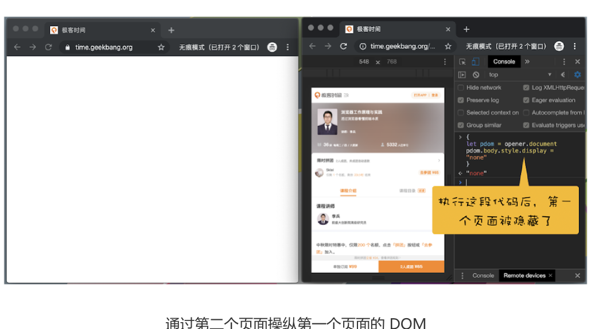

# 32 | 同源策略：为什么XMLHttpRequest不能跨域请求资源？

浏览器安全可以分为三大块——**Web 页面安全、浏览器网络安全和浏览器系统安全**，所以
本模块我们就按照这个思路来做介绍。鉴于页面安全的重要性，我们会用三篇文章来介绍该
部分的知识；网络安全和系统安全则分别用一篇来介绍。


Web 世界会是开放的，任何资源都可以接入其中，我们的网站可以加载并执行别人网站的
脚本文件、图片、音频 / 视频等资源，甚至可以下载其他站点的可执行文件。

Web 世界是开放的，这很符合 Web 理念。但如果 Web 世界是绝对自由的，那么页面行
为将没有任何限制，这会造成无序或者混沌的局面，出现很多不可控的问题。

比如你打开了一个银行站点，然后又一不小心打开了一个恶意站点，如果没有安全措施，恶
意站点就可以做很多事情：

这就引出了页面中最基础、最核心的安全策略：同源策略（Same-origin policy）。

- 修改银行站点的 DOM、CSSOM 等信息；
- 在银行站点内部插入 JavaScript 脚本；
- 劫持用户登录的用户名和密码；
- 读取银行站点的 Cookie、IndexDB 等数据；

甚至还可以将这些信息上传至自己的服务器，这样就可以在你不知情的情况下伪造一些转
账请求等信息。

所以说，在**没有安全保障的 Web 世界中，我们是没有隐私的**，因此需要安全策略来保障我
们的隐私和数据的。

这就引出了页面中最基础、最核心的安全策略：**同源策略（Same-origin policy)**。


## 什么是同源策略

先看什么是同源？
**如果两个URL的协议、域名和端口相同，我们就称两个URL同源**。比如下面这两个
URL，它们具有相同的协议 HTTPS、相同的域名 time.geekbang.org，以及相同的端口
443，所以我们就说这两个 URL 是同源的。

```json
https://time.geekbang.org/?category=1
https://time.geekbang.org/?category=0
```
体来讲，同源策略主要表现在 DOM、Web 数据和网络这三个层面。

**第一个，DOM层面**同源策略限制来自不同源的JavaScript脚本当前当前DOM对象读和写操作

还是拿极客时间的官网做例子，打开极客时间的官网，然后再从官网中打开另外一个专栏页面，如图所示

由于第一个页面和第二个是同源关系，所以我们可以在第二个页面中操作第一个页面的DOM，比如将第一个页面全部隐藏掉

```js
{
    let pdom=opener.document
    pdom.body.style.display="none"
}
```
该代码中，对象 opener 就是指向第一个页面的 window 对象，我们可以通过操作
opener 来控制第一个页面中的 DOM。

我们在第二个页面的控制台中执行上面那段代码，就成功地操作了第一个页面中的 DOM，将页面隐藏了，如下图：



**第二个，数据层面。**同源策略限制不同源的站点读取当前站点Cookie、IndexDB、LocalStorage等数据。由于同源策略、我们依然无法通过第二个opener 来访问第一个页面中的 Cookie、IndexDB 或者 LocalStorage 等内容。