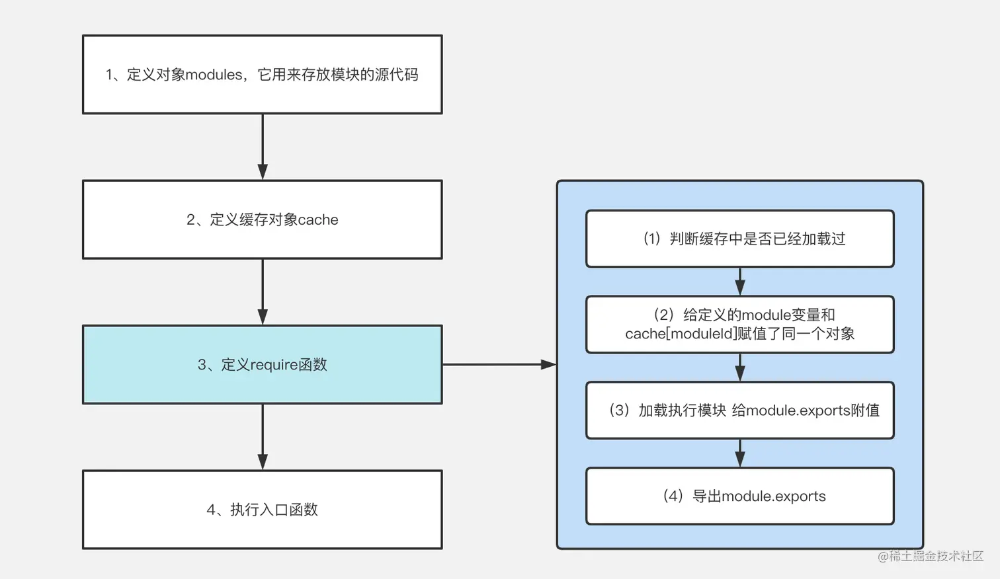
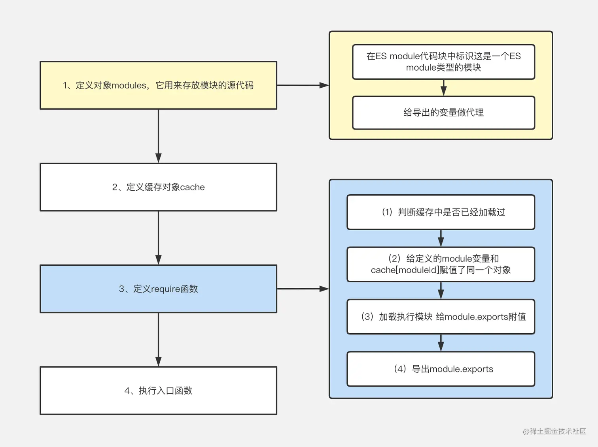

# 前言

本文将从前端模块化的发展历史出发，逐步探讨CommonJs规范和ES Module之间的异同。
最后将深入模块化内部原理进行多维度剖析，彻底弄懂Web环境下Webpack如何支持模块化。


> 在正式开始之前看几个常见的面试题

- 模块化的产生是为了解决什么问题?在什么场景下诞生的?
- Web环境中如何支持模块化的?加载过程是怎么样的?
- CommonJS可以加载ES Module导出的内容吗？
- ES Module可以加载CommonJS导出的内容吗?
- Webpack内部是如何区分一个模块是采用的哪种模块化规范？
- 一个模块内可以既使用CommonJS，又使用ES Module吗


# 二、前置知识
**Object.prototype.toString这个方法来判断数据的类型

```js
console.log(Object.prototype.toString.call('hello'))
Object.prototype.toString.call([1,3])
Object.prototype.toString.call(3)
Object.prototype.toString.call(true)


const obj={}

//定义属性
Object.defineProperty(obj,Symbol.toStringTag,{value:'Module'})


//查看自定义类型
console.log(Object.prototype.toString.call(obj))

```


# 三、模块化发展历史


早期JavaScript开发很容易存在**全局污染**和**依赖管理**混乱问题，这些问题
在多人开发前端应用的情况下变得更加棘手

```js
<body>
    <srcipt src="./index.js"></srcipt>
    <srcipt src="./home.js"></srcipt>
    <srcipt src="./list.js"></srcipt>
</body>
```

没有模块化，那么script内部的变量是可以相互污染，./index.js文件和./list.js
分别由小A和小B开发

小A在index.js声明name属性是一个字符串
```js
var name='不要秃头啊'
```

然后小A在list.js，引用name属性
```js
console.log(name)
```
答应却发现name竟然变成一个函数，刚开始小A不知所措，然后发现小B开发home.js

```js
function  name(){
    //...
}
```

上述例子就是没有使用模块化开发，造成的全局污染的问题，**每个加载的js文件都共享变量**

当然，实际在项目开发中，**可以使用匿名函数自执行的方式，形成独立的块级作用域**解决这个问题

```js
(function(){
    function name(){
        //...
    }
})()
```

这样小A就能正常在list.js获取name属性

但是，这又带来新的问题
- 我必须记得每一个**模块中返回对象的命名**，才能在其他模块使用过程中正确的使用
- 代码写起来**杂乱无章**，每个文件中代码都需要包裹在一个匿名函数中来编写
- 在**没有合适的规范**情况下，每个人、每个公司都可能任意命名、甚至出现模块名称相同

所以现在急需一个统一的规范，来解决这些缺陷问题，就此**CommonJS规范**出世


# 四、CommonJS规范

**CommonJS**是一个规范，最初提出在浏览器以外地方使用，并且命名为**ServerJS**，后来修改为**CommonJS**。**Node**是CommonJS在服务器端一个具有代表性的实现

正是因为Node中对**CommonJS**进行了支持和实现，所以它具备以下几个特点
- 在Node中**每一个js文件都是一个单独的模块**
- 该模块中，包含CommonJS规范的核心变量:**exports**、**module.exports**、**require**
- 使用核心遍历，进行**模块化**开发
  
```js
//在a.js中导出变量
const name="不要秃头啊"
const age="18"
module.exports={name,age}

//或者:
exports.name="不要秃头啊"
exports.age="18"


//在b.js中引用导出变量
const {name,age}=require("./a")
console.log(name,age)
```


# 五、ES Module规范

Nodejs借鉴Commonjs实现模块化。从ES6开始，JavaScript才真正意义上有自己的模块化规范

Es Module的产生有很多优势，比如：
- 借助Es Module的静态导入导出的优势，实现tree shaking
- Es Module还可以import()懒加载方式实现代码分割
  
在 ES Module中用export导出模块，import引入模块

```js
/**
 * 导出
 */
export * from 'module'; //重定向导出 不包括 module内的default
export { name1, name2, ..., nameN } from 'module'; // 重定向命名导出
export { import1 as name1, import2 as name2, ..., nameN } from 'module'; // 重定向重命名导出
export { name1, name2, …, nameN }; // 与之前声明的变量名绑定 命名导出
export { variable1 as name1, variable2 as name2, …, nameN }; // 重命名导出
export let name1 = 'name1'; // 声明命名导出 或者 var, const，function， function*, class
export default expression; // 默认导出
export default function () { ... } // 或者 function*, class
export default function name1() { ... } // 或者 function*, class

/**
 * 导入
 */
import defaultExport from "module"; // 默认导入
import { a, b, c } from "module"; //解构导入
import defaultExport, { a, b, c as newC } from "module"; //混合导入
import * as name from "module"; //混合导入
var promise = import("module"); //动态导入(异步导入)


```

# 六、在Webpack中的基本配置

在使用Webpack搭建的项目中，它是允许我们使用各种各样的模块化。常用的方式 CommonJS和ES Module。那么它内部
是如何·帮助我们实现了代码中支持模块化呢?

- CommonJS模块化实现原理
- ES Module实现原理
- CommonJS 加载ES Module的原理
- ES Module加载CommonJS的原理

统一配置
```js
"webpack":"^5.73.0",
"webpack-cli":"^4.10.0",
```

Webpack基本配置:webpack.config.js

```js
module.exports={
    mode:'development',//防止代码压缩
    entry:"./src/main.js",
    devtool:"source-map",//查看打包后的代码更方便
}


```


# 七、CommonJS模块化实现原理

name.js

```js
module.exports="不要秃头啊"
```

main.js
```js
let author=require("./name.js")
console.log(author,"author")
```

- name.js中有一个module对象，module对象上有exports属性，给exports属性赋值为"不要秃头啊"
- main.js中，调用require函数，入参为模块路径(./name.js),最后返回值为module.exports


- 设计这个运行流程

```js
var modules={
    "./name.js":()=>{
        var  module={};
        module.exports="不要秃头"
        return module.exports
    }
}

var require=(modulePath)=>{
    return modules[modulePath]()
}

let author=require("./name.js")
console.log(author)

```
以上就是CommonJS能在浏览器中运行的核心思想
接下来看看具体源码中实现(对打包后的内容进行调整优化)

主要分为几个部分
- 初始化:定义modules对象
- 定义缓存对象cache
- 定义加载模块函数require
- 执行入口函数

> 初始化定义modules对象
```js
//初始化:定义了一个对象modules，key为模块路径 value是一个函数，函数就是我们编写的代码
var modules={
    "./src/name.js":(module)=>{
        module.exports="不要秃头啊"
    }
}
```

> 定义缓存对象cache

```js
var  cache={}
```

> 定义加载模块函数require

require:接受模块的路径为参数，返回具体的模块的内容

```js
function require(modulePath){
    var cacheModule=cache[modulePath]//获取模块缓存
    if(cacheModule!=undefined){
        //如果有缓存则不允许模块内容，直接return导出的值
        return cachedModule.exports
    }
    //如果没有缓存，则定义module对象，定义exports属性
    //注意module=cache[modulePath]代表引用的是同一个内存地址
    var  module=(cache[modulePath]={
        export:{}
    })

    //导入module.exports对象
    return module.exports

}
```

> 执行入口函数
防止命名冲突，包装成一个立即执行函数
```js
(()=>{
    let author=require("./src/main.js")
    console.log(author,"author")
})()

```

> 整体代码


```js
//模块定义
var modules={
    "./src/name.js":(module)=>{
        //要传递两次参数，第一次是path路径，第二次是module对象
        module.exports="不要秃头啊"
    }
}
var cache={}

//接受模块的路径为参数，返回具体的模块的内容
function require(modulePath){
    var cachedModule=cache[modulePath];//获取模块路径
    if(cacheModule!==undefined){
        //如果有缓存则不允许模块内容，直接return导出结果
        return cachedModule.exports
    }
    //如果没有缓存，则定义module对象，定义exports属性
      //这里注意！！！module = cache[modulePath] 代表引用的是同一个内存地址
      var module=(cache[modulePath]={
        exports:{}
      })

      //运行模块内的代码，在模块代码中会给module.exports对象赋值
  modules[modulePath](module, module.exports, require);

  //导入module.exports对象
  return module.exports; 

}
(() => {
  let author = require("./src/name.js");
  console.log(author, "author");
})();
```
**var  module=(cache[modulePath]={
        export:{}
    }),module===cache[modulePath],其中有个export属性是一个对象**
# 八、ES Module模块化原理

name.js
```js
const author="不要秃头啊"

export const age="18"

export default author
```

main.js

```js
import author,{age} from "./name"

console.log(author,"author")
console.log(age,"age")
```

将name.js中导出的内容挂载到exports对象上,如果是通过export default
方式导出的，那就在exports对象加一个default属性，将name.js导出内容变成这样：

```js
const exports={
    age:"18",
    default:"不要秃头啊”
}
```
然后在模块引用(在Webpack编译时会将import author from “./name”)代码转换成
const exports=require(./name),这样在main.js中拿到exports对象，就能够正常取值

大致原理就是这么简单，只不过这里给exports赋值的方式是通过代理做到的。


```js
//模块定义
var modules = {
  "./src/name.js": (module, exports, require) => {
    //给该模块设置tag：标识这是一个ES Module
    require.setModuleTag(exports);
    //通过代理给exports设置属性值
    require.defineProperty(exports, {
      age: () => age,
      default: () => DEFAULT_EXPORT,
    });
    const author = "不要秃头啊";
    const age = "18";
    const DEFAULT_EXPORT = author;
  },
};

var cache = {};
function require(modulePath) {
  var cachedModule = cache[modulePath];
  if (cachedModule !== undefined) {
    return cachedModule.exports;
  }
  var module = (cache[modulePath] = {
    exports: {},
  });
  modules[modulePath](module, module.exports, require);
  return module.exports;
}

//对exports对象做代理
require.defineProperty = (exports, definition) => {
  for (var key in definition) {
    Object.defineProperty(exports, key, {
      enumerable: true,
      get: definition[key],
    });
  }
};

//标识模块的类型为ES Module
require.setModuleTag = (exports) => {
  Object.defineProperty(exports, Symbol.toStringTag, {
    value: "Module",
  });

  Object.defineProperty(exports, "__esModule", {
    value: true,
  });
};

//以下是main.js编译后的代码
//拿到模块导出对象exports
var _name__WEBPACK_IMPORTED_MODULE_0__ = require("./src/name.js");

console.log(_name__WEBPACK_IMPORTED_MODULE_0__["default"], "author");
console.log(_name__WEBPACK_IMPORTED_MODULE_0__.age, "age");

```

1. 通过require.setModule函数来标识这是一个ES Module(在现在这个例子中其实没什么作用)
2. 给传入的 exports 对象通过 Object.defineProperty 做了一层代理（这样当访问default属性时，其实访问的是DEFAULT_EXPORT变量，访问age属性时，访问的是age变量）。