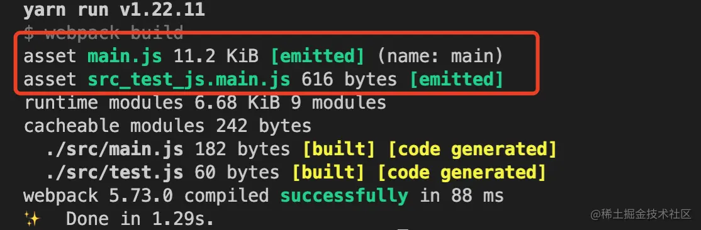
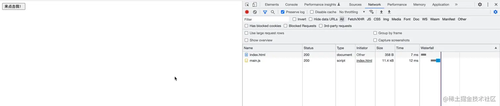

# 前言

- webpack搭建的项目中，如何达到懒加载的效果？
- webpack中常用的代码分割方式有哪些？
- webpack中懒加载原理是什么？

# 二、前置只是
懒加载或者按需加载，是一种很好的优化网页或应用的方式。
**这种方式实际上是将代码在一些逻辑断点处分离开，然后在一些代码块中完成某些操作，
立即引用或者引用另外一些新的代码块。**这样加快了应用的初始加载速度，减轻总体积，
因为某些代码块可能永远不会被加载。

**懒加载的本质实际上就是代码分离，把代码分离到不同的bundle中，然后按需加载或并行加载这些文件**


在Webpack中常用的代码分离方法有三种:
- 入口起点:使用entry配置手动地分离代码
- 防止重复:使用Entry dependencies或者SplitChunksPlugin去重和分离chunk
- 动态导入:通过模块的内联函数调用分离代码

**import语法**，该函数接受一个参数，就是引用模块的地址，并且使用promise式的回调获取加载的模块。
在代码中所有被import()的模块，都将打成一个单独的模块，放在chunk存储的目录下。在浏览器运行到这一行
代码时，就会自动请求这个资源，实现异步加载。


# 三、统一配置

```js
  "webpack": "^5.73.0",
  "webpack-cli": "^4.10.0",


  //webpack.config.js
module.exports = {
  mode: "development",
  devtool: false,
  entry: {
    main: "./src/main.js",
  },
  output: {
    filename: "main.js", //定义打包后的文件名称
    path: path.resolve(__dirname, "./dist"), //必须是绝对路径
  },
};

```

# 四、import()基本使用

先看看import()异步加载的效果

```js
const buttonEle = document.getElementById("button");

buttonEle.onclick = function () {
  import("./test").then((module) => {
    const print = module.default;
    print();
  });
};

//test.js

export default () => {
  console.log("按钮点击了");
};

```
打包结果，将main.js和test.js打包成了两个文件(说明有做代码分割)



```html
<!DOCTYPE html>
<html lang="en">
  <head>
    <meta charset="UTF-8" />
    <meta http-equiv="X-UA-Compatible" content="IE=edge" />
    <meta name="viewport" content="width=device-width, initial-scale=1.0" />
    <title>Document</title>
  </head>
  <body>
    <button id="button">来点击我！</button>
  </body>
  <script src="./main.js"></script>
</html>
```
点击按钮


# 五、原理分析


效果



