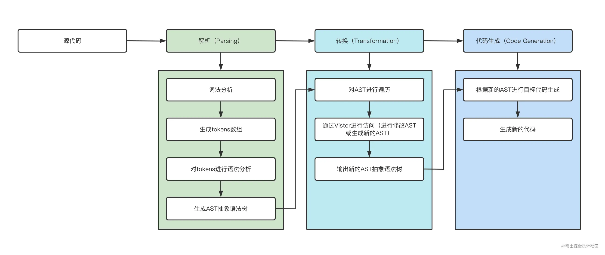
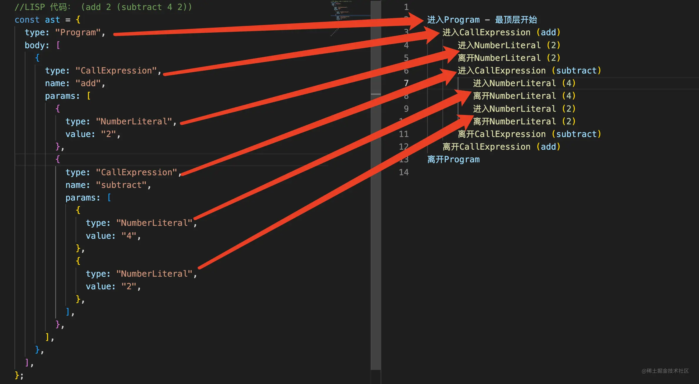

# 三、手写编译器


## 3.1设计篇

### 3.1.1整体流程

一个完整的编译器整体执行过程分为三个步骤

1. Parsing(解析过程):这个过程要经词法分析、语法分析、构建AST(抽象语法树)一系列操作
2. Transform(转化过程):这个过程就是把上一步解析后的内容，按照编译器指定的规则进行处理，
形成一个新的表现形式
3. Code Generation(代码生成):将上一步处理好的内容转化为新的代码



将lisp的函数编译成类似C的函数

```jw
    LISP 代码： (add 2 (subtract 4 2))
    C    代码  add(2, subtract(4, 2))
    释义： 2 + （ 4 - 2 ）
```

### 3.1.2 Parsing(解析)

解析过程分为2个步骤：**词法分析**，**语法分析**

词法分析使用tokenizer(分词器)或者lexer(词法分析器)，将源码拆分成tokens，
**tokens是一个放置对象的数组，其中的每一个对象都看成是一个单元(数字、标签、操作符……)的描述信息**

(add 2 (substract(4 2)))
```js
[
    {type:"parser",value:"("},
    {type:"name",value:"add"},
    {type:"number",value:"2"},
    {type:"paren",value:"("},
    {type:"name".value:"subtract"},
    {type:"number",value:"4"},
    {type:"number",value:"2"},
    {type:"paren",value:")"},
    {type:"paren",value:")"}
]
```
得到tokens，还要进行语法分析

**语法分析**则是将tokens重新整理成语法相互关联的表达式，这种表达式一般成为
中间层或者AST(语法树)

(add 2 (subtratct(4 2)))进行语法解析得到AST:
```js
{
    type:'Program',
    body:[{
        type:'CallExpression',
        name:'add',
        params:
        [{
            type:'NumberLiteral',
            value:'2'
        }，{
            type:'CallExpression',
            name:'subtract',
            params:[{
                type:'NumberLiteral'，
                value：'4'
            },{
                  type:'NumberLiteral'，
                value：'2'
            }]
        }]
    }]
}

```

### 3.1.3 Transformation(转化)

这个过程只要是**改写AST(抽象语法树)，或者根据当前AST(抽象语法树)生成一个新的AST(抽象语法树)**，这个过程可以是相同语言，或者可以直接将AST(抽象语法树)翻译为其他语言


```json
// 数字片段节点
{
   type: 'NumberLiteral',
   value: '2',
}

// 调用语句节点
 {
   type: 'CallExpression',
   name: 'subtract',
   params: [{
     type: 'NumberLiteral', // 数字片段节点
     value: '4',
   }, {
     type: 'NumberLiteral', // 数字片段节点
     value: '2',
   }]
 }

```

想要将lisp语言转化为C语言，因此需要构建一个新的AST(抽象语法树)，这个创建过程
**需要遍历这个树的节点**，因此引出**Traversal(遍历)**和**Vistor(访问器)**

Traversal(遍历)：顾名思义这个过程就是，遍历这个AST(抽象语法树)的所有节点，这个
过程使用**深度优先原则**




**Visitor(访问器)**:访问器最基本的思想创建一个“访问器”对象，这个对象可以处理不同类型的节点函数，如下

```js
const vistor={
    NumberLiteral(node,parent){},//处理数字类型节点
    CallExpression(node,parent){}//处理调用语句；类型节点
}
```
在遍历节点的时候，当enter(进入)该节点，我们会调用访问器，然后调用针对于这个节点的相关函数，同时这个节点和其父节点作为参数传入

同时在exit(离开)的时候也希望能调用访问器，当enter一个节点的时候，最外层节点相当于一个分支，他是一个节点，这个分支的内部依然存在若干节点，就像上边遍历一样。

我们会按照深度优先的原则，依次遍历这个分支的最内层，当达到最内层的时候，针对当前分支的回访也就完成了，接着会依次exit(退出)节点，这个过程是由由内向外的

```js
const visitor={
    NumberLiteral:{
        enter(node,parent){},
        exit(node,parent){}
    }
}

```

### 3.1.4 Code Generation(生成代码)

**其实就将生成的新AST树再转回代码的过程**。大部分的代码生成器主要过程，不断访问
Transformation生成AST(抽象语法树)或者再结合tokens，按照指定的规则，将树上的节点答应拼接最终还源为新的code，自此编译器的执行过程就结束。

## 3.2手撕篇

### 3.2.1生成Tokens
tokens函数就是把字符串每个值都判断一下类型，然后生成对应的对象，添加到数组中
**层级结构怎么搞出来的**

```js
function tokenizer (input) {
  let current = 0; //记录当前访问的位置
  let tokens = [] // 最终生成的tokens
  // 循环遍历input
  while (current < input.length) {
    let char = input[current];
    // 如果字符是开括号，我们把一个新的token放到tokens数组里，类型是`paren`
    if (char === '(') {
      tokens.push({
        type: 'paren',
        value: '(',
      });
      current++;
      continue;
    }
    // 闭括号做同样的操作
    if (char === ')') {
      tokens.push({
        type: 'paren',
        value: ')',
      });
      current++;
      continue;
    }
    //空格检查，我们关心空格在分隔字符上是否存在，但是在token中他是无意义的
    let WHITESPACE = /\s/;
    if (WHITESPACE.test(char)) {
      current++;
      continue;
    }
    //接下来检测数字，这里解释下 如果发现是数字我们如 add 22 33 这样
    //我们是不希望被解析为2、2、3、3这样的，我们要遇到数字后继续向后匹配直到匹配失败
    //这样我们就能截取到连续的数字了
    let NUMBERS = /[0-9]/;
    if (NUMBERS.test(char)) {
      let value = '';
      while (NUMBERS.test(char)) {
        value += char;
        char = input[++current];
      }
      tokens.push({ type: 'number', value });
      continue;
    }

    // 接下来检测字符串,这里我们只检测双引号，和上述同理也是截取连续完整的字符串
    if (char === '"') {
      let value = '';
      char = input[++current];
      while (char !== '"') {
        value += char;
        char = input[++current];
      }
      char = input[++current];
      tokens.push({ type: 'string', value });
      continue;
    }
    // 最后一个检测的是name 如add这样，也是一串连续的字符，但是他是没有“”的
    let LETTERS = /[a-z]/i;
    if (LETTERS.test(char)) {
      let value = '';
      while (LETTERS.test(char)) {
        value += char;
        char = input[++current];
      }
      tokens.push({ type: 'name', value });
      continue;
    }
    // 容错处理，如果我们什么都没有匹配到，说明这个token不在我们的解析范围内
    throw new TypeError('I dont know what this character is: ' + char);
  }
  return tokens
}

```

### 3.2.2 生成AST
**有层级结构了---就是递归就想二叉树树生成子树，而且这里不要区分左右**

第二步:将生成好的tokens转化为AST。现在需要定义parser函数，接收上一步处理好的tokens


```js


```


### 3.2.3 遍历和访问生成好的AST

```js
traverse(ast,{
  Program:{
    enter(node,parent){
      //...
    },
    exit(node,parent){
      //...
    }
  },
  CallExperssion:{
    enter(node,parent){

    }，
    exit(node,parent){

    }
  },
    NumberLiteral: {
    enter(node, parent) {
      // ...
    },
    exit(node, parent) {
      // ...
    },
  }
})'


```

### 3.2.4 Transformer转化
现在生成好AST，需要转化。**从一种ast转化成另外一种ast**

```json
*   Original AST                     |   Transformed AST
* ----------------------------------------------------------------------------
*   {                                |   {
*     type: 'Program',               |     type: 'Program',
*     body: [{                       |     body: [{
*       type: 'CallExpression',      |       type: 'ExpressionStatement',
*       name: 'add',                 |       expression: {
*       params: [{                   |         type: 'CallExpression',
*         type: 'NumberLiteral',     |         callee: {
*         value: '2'                 |           type: 'Identifier',
*       }, {                         |           name: 'add'
*         type: 'CallExpression',    |         },
*         name: 'subtract',          |         arguments: [{
*         params: [{                 |           type: 'NumberLiteral',
*           type: 'NumberLiteral',   |           value: '2'
*           value: '4'               |         }, {
*         }, {                       |           type: 'CallExpression',
*           type: 'NumberLiteral',   |           callee: {
*           value: '2'               |             type: 'Identifier',
*         }]                         |             name: 'subtract'
*       }]                           |           },
*     }]                             |           arguments: [{
*   }                                |             type: 'NumberLiteral',
*                                    |             value: '4'
* ---------------------------------- |           }, {
*                                    |             type: 'NumberLiteral',
*                                    |             value: '2'
*                                    |           }]
*                                    |         }
*                                    |       }
*                                    |     }]
*                                    |   }s

```

### 3.2.5 新代码生成

最后一步:新代码生成。**用信道AST，遍历每个节点，根据指定规则生成最终代码**

